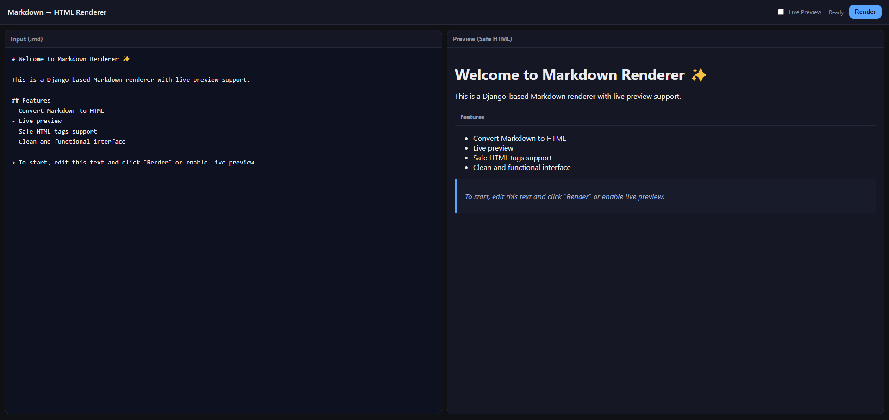

# Django Markdown Renderer

A Django application that provides a beautiful, real-time Markdown editor and renderer. Perfect for adding Markdown editing capabilities to your Django projects with minimal setup. Developed by xoxxel.



## Installation

### Installing the Package
You can install `django-markdown-renderer` directly from PyPI:

```bash
pip install django-markdown-renderer
```

### Setting Up the Project
If you prefer to work with the source code or contribute to the project, follow these steps:

1. **Clone the Repository**:
   ```bash
   git clone https://github.com/xoxxel/django-markdown-renderer.git
   cd django-markdown-renderer
   ```

2. **Create and Activate a Virtual Environment**:
   ```bash
   python -m venv venv
   source venv/bin/activate  # On Windows: venv\Scripts\activate
   ```

3. **Install Dependencies**:
   The package requires Django and other dependencies listed in `requirements.txt`. Install them with:
   ```bash
   pip install -r requirements.txt
   ```

4. **Configure Environment Variables**:
   Create a `.env` file in the project root with the following settings:
   ```
   DEBUG=True
   SECRET_KEY=your-secret-key-here
   ALLOWED_HOSTS=localhost,127.0.0.1
   ```
   Replace `your-secret-key-here` with a secure, unique key. For production, set `DEBUG=False` and update `ALLOWED_HOSTS` accordingly.

5. **Add to Django Settings**:
   In your Django project's `settings.py`, add `markdown_renderer` to `INSTALLED_APPS`:
   ```python
   INSTALLED_APPS = [
       ...
       'markdown_renderer',
   ]
   ```

6. **Run Migrations**:
   Apply the database migrations to set up the necessary models:
   ```bash
   python manage.py migrate
   ```

7. **Run the Development Server**:
   Start the Django development server to test the application:
   ```bash
   python manage.py runserver
   ```
   The application will be available at `http://127.0.0.1:8000`.

### Requirements
- Python 3.7 or higher
- Django 3.2 or higher
- Other dependencies are listed in `requirements.txt`

## Features

- **Markdown to HTML Rendering**: Converts Markdown text to clean, safe HTML using a robust parser.
- **Live Preview**: Real-time rendering of Markdown as you type, with instant feedback.
- **Safe HTML Support**: Sanitizes output to prevent XSS attacks, supporting only safe HTML tags and attributes.
- **Simple and Functional UI**: Intuitive interface with a clean design, suitable for blogs, documentation, or CMS.
- **Copy-to-Clipboard**: Easily copy the generated HTML for use in other applications.
- **Customizable**: Easily extendable for additional Markdown extensions or styling.

## Usage

1. **Access the Editor**:
   Navigate to `http://127.0.0.1:8000` (or your configured URL) to access the Markdown editor.

2. **Enter Markdown Text**:
   Type or paste your Markdown content into the editor. The live preview will display the rendered HTML instantly.

3. **Copy HTML Output**:
   Use the "Copy" button to copy the generated HTML to your clipboard for use in other applications or CMS platforms.

4. **Customize Output (Optional)**:
   Developers can extend the renderer by adding Markdown extensions (e.g., `markdown.extensions.tables`) or customizing the CSS for the preview.

### Example Use Cases
- **Blog Platforms**: Integrate the renderer into a Django-based blog to allow users to write posts in Markdown.
- **Documentation Sites**: Use it to create or edit technical documentation with real-time previews.
- **Content Management Systems**: Add Markdown editing capabilities to a CMS for non-technical users.
- **Educational Tools**: Build interactive learning platforms where students can write and preview Markdown content.
- **Static Site Generators**: Use the renderer to preview Markdown content before generating static HTML pages.

## Configuration

### Adding Markdown Extensions
To enhance Markdown parsing (e.g., support for tables, code blocks, or footnotes), modify the `settings.py`:
```python
MARKDOWN_RENDERER_EXTENSIONS = [
    'markdown.extensions.tables',
    'markdown.extensions.fenced_code',
    'markdown.extensions.footnotes',
]
```

### Customizing the UI
The editor's appearance can be customized by overriding the CSS. Place your custom styles in `static/markdown_renderer/css/custom.css` and load them in your templates.

### Template Integration
To embed the editor in your own Django templates:
1. Include the renderer’s template tag:
   ```django
   
   
   ```
2. Ensure static files are loaded:
   ```django
   
   <link rel="stylesheet" href="">
   ```

## Development

To contribute to the project:
1. Fork the repository on GitHub.
2. Create a new branch for your feature or bug fix.
3. Run tests using:
   ```bash
   python manage.py test
   ```
4. Submit a pull request with a clear description of your changes.

## License

This project is released under the MIT License. See the `LICENSE` file for details.

## Support

For issues, feature requests, or contributions, please visit the [GitHub repository](https://github.com/xoxxel/django-markdown-renderer) or contact xoxxel via email at [xoxxel.com@gmail.com].
